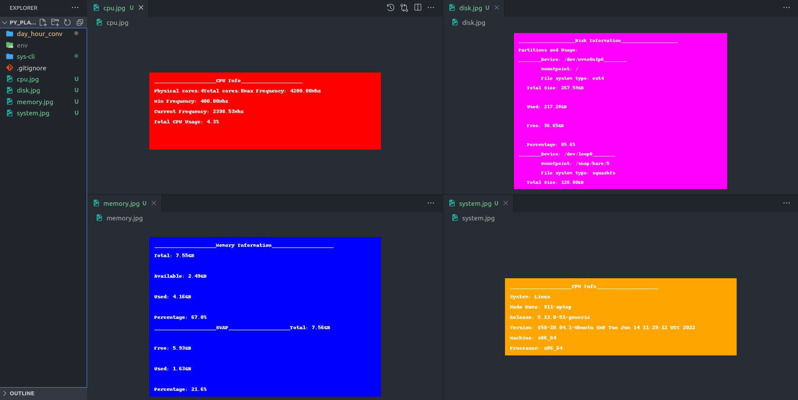

## sys_cli

a command line interface to generate jpg images containing system info, mainly using the (os,platform) modules in python.

```bash
sys.py show --info=system
sys.py show --info=disk
sys.py show --info=cpu
sys.py show --info=memory
```


